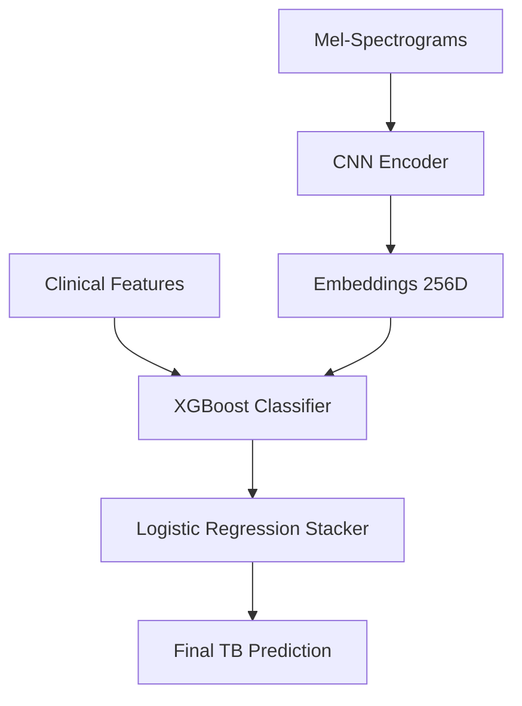

# AcousticTB: TB Screening from Cough Analysis

An end-to-end machine learning pipeline for tuberculosis screening using cough audio analysis, designed for resource-limited clinical settings.

## Overview

This project implements a machine learning pipeline for TB screening using:
- **CNN**: Mel-spectrogram feature extraction with focal loss
- **XGBoost**: Ensemble learning on embeddings + clinical data
- **Data Augmentation**: ESC-50 environmental noise for robustness
- **Imbalanced Learning**: Handles 30% TB+, 70% TB- distribution

### Architecture Overview



## Performance (Validation)

| Metric | Value |
|--------|-------|
| **ROC-AUC** | **0.850** |
| Sensitivity (Recall) | 72.9% |
| Specificity | 80.4% |
| PPV (Precision) | 61.8% |
| NPV | 87.2% |
| Accuracy | 78.1% |
| PR-AUC | 0.748 |

### Noise Robustness (AUC)
- **Clean**: 0.862
- **Gaussian**: 0.855  
- **Environmental**: 0.833

*Patient-wise split; results computed on a held-out validation set consistent with the notebook.* 

## Quick Start

1. **Clone repository**:
git clone https://github.com/your-username/AcousticTB.git
cd AcousticTB

3. **Install dependencies**:
pip install tensorflow scikit-learn xgboost librosa matplotlib seaborn tqdm pandas numpy

4. **Run data augmentation**:
python %run src/data_augmentation.py

6. **Execute pipeline**: Open and run \AcousticTB_FINAL.ipynb\

## Project Structure

```
AcousticTB/
├── AcousticTB_FINAL.ipynb     # Main pipeline notebook
├── data/
│   ├── raw/                      # Original CODA dataset (available at https://www.synapse.org/Synapse:syn31472953/wiki/617828) 
│   │   └── solicited_coughs/
│   │       ├── audio/            # .wav files
│   │       └── metadata/         # Clinical data
│   └── processed/                # Mel-spectrograms & metadata
│       └── features/             # Processed .npy files
├── src/
│   ├── data_augmentation.py      # Noise augmentation pipeline
│   └── utils.py                  # Helper functions
├── requirements.txt           # Dependencies
└── README.md                  # This file
```

## Technical Approach

### Deep Learning Architecture 
CNN Encoder (256 parameters: 1.2M)
- Conv2D(64) → BatchNorm → Conv2D(64) → MaxPool → Dropout(0.2)
- Conv2D(128) → BatchNorm → Conv2D(128) → MaxPool → Dropout(0.3)  
- Conv2D(256) → BatchNorm → Conv2D(256) → MaxPool → Dropout(0.4)
- GlobalAvgPool → Dense(512) → Dense(256) → Dense(1, sigmoid)

### Focal Loss
- focal_loss = -α * (1-p_t)^γ * log(p_t)
- γ = 2.0: Strong focus on hard examples
- α = 0.25: Moderate class balancing
- Optimized for AUROC in a medical context

### Data Augmentation Strategy
- **Clean cough sounds**: Original recordings
- **Environmental noise**: ESC-50 real-world sounds (rain, traffic, etc.)
- **Gaussian noise**: Statistical backup augmentation
- **SNR=20dB**: Realistic noise levels

### Ensemble Architecture
1. **CNN**: Extracts 256-dim embeddings from mel-spectrograms
2. **XGBoost**: Combines embeddings + clinical features
3. **Logistic Regression**: Final stacking layer

### Parameters
XGBoost:
learning_rate: 0.0751
n_estimators: 661
max_depth: 7
subsample: 0.8320
colsample_bytree: 0.8448
reg_alpha: 0.0223
reg_lambda: 0.2689
scale_pos_weight: 6.1896
objective: binary:logistic, eval_metric: auc, tree_method: hist

### LogReg: 
solver: lbfgs
max_iter: 2000
regularization: L2 (C = 0.1)
class_weight: balanced
5-fold CV TB-composite score ≈ 0.888 (0.56·Sensitivity + 0.44·Specificity)

## Medical Application

Designed for resource-limited clinical settings where:
- TB screening is critical, but diagnostic tools are limited
- High sensitivity required (avoid missing TB+ cases)
- Acceptable specificity to minimize false alarms
- Robust to environmental noise conditions

###Dataset
TB cough audio: CODA TB DREAM dataset (restricted; request access on [Synapse]([url](https://www.synapse.org/Synapse:syn31472953/wiki/619711)))
Environmental sounds: ESC-50 ([public]([url](https://github.com/karolpiczak/ESC-50?tab=readme-ov-file#citing)))
Processing: 64×64 log-Mel spectrograms (librosa STFT + Mel filters; typical fs ≈ 22 kHz)

## Results Analysis

The model includes a comprehensive evaluation:
- **ROC/PR curves**: Performance visualization
- **Confusion matrices**: Clinical decision analysis  
- **Feature importance**: Interpretability for medical use
- **Noise resilience**: Performance across environments

Results on validation set:
Total samples: 5865 | TB+: 1785 (30.4%) | TB-: 4080 (69.6%)
Training patients: 7817 | Validation patients: 1955


## Requirements

- Python 3.8+
- TensorFlow 2.8+
- XGBoost 1.6+
- Librosa 0.9+
- Scikit-learn 1.0+

## Dataset

- **TB Cough Data**: CODA TB Challenge dataset (restricted access)
- **Environmental Sounds**: ESC-50 (publicly available)
- **Processing**: Mel-spectrograms (64x64) at 22kHz

## Key Innovation

Advanced ensemble architecture combining deep learning and gradient boosting with **focal loss optimization** specifically tuned for medical screening scenarios where missing positive TB cases have significantly higher clinical cost than false positives.


